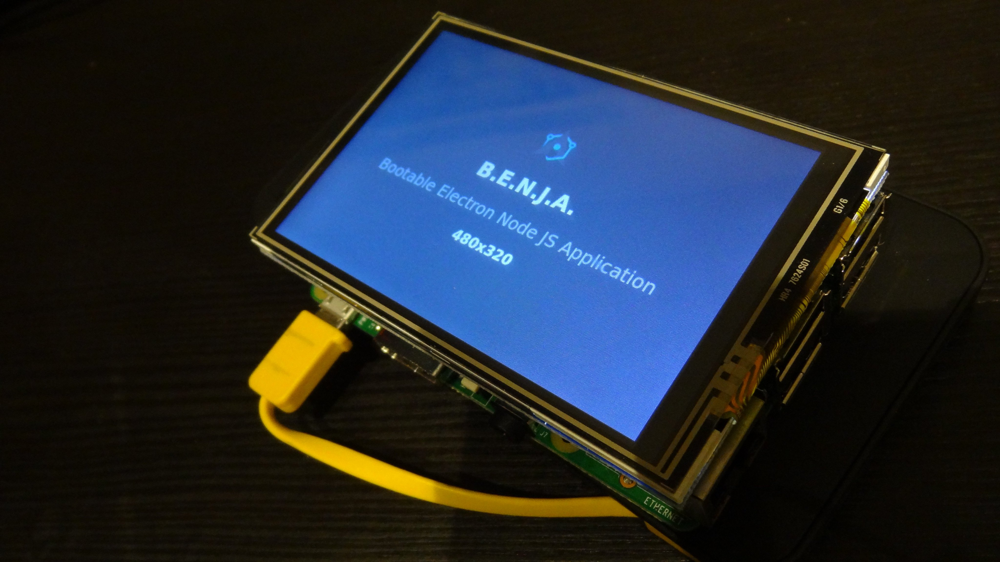

# Andrea Giammarchi

*Core web platform engineer · performance, security, and the full stack · 25+ years hands-on*

Also at [webreflection.github.io/about](https://webreflection.github.io/about/) — feedback welcome via [GitHub](https://github.com/WebReflection/about).

  * **Role:** Principal Software Engineer
  * **Location:** Italy (currently working remotely 100%)

  * **GitHub:** [https://github.com/WebReflection/](https://github.com/WebReflection/)
  * **Blog:** [https://webreflection.medium.com/](https://webreflection.medium.com/)
  * **X:** [https://x.com/WebReflection](https://x.com/WebReflection)
  * **LinkedIn:** [https://www.linkedin.com/in/andrea-giammarchi-465bb61/](https://www.linkedin.com/in/andrea-giammarchi-465bb61/)

---

A brief overview of what I do and where I bring the most value. I have been building software professionally for over 25 years, across databases, backends, frontends, and several languages. I tend to work on core infrastructure, performance, and hard problems rather than visual design — though I am comfortable across the full stack when the project needs it.

### Showcases

Hands-on demos at the intersection of the web platform, IoT, and embedded UIs:

- **PyScript + MicroPython (WASM)** driving a LEGO Spike Prime over Web Bluetooth — remote API orchestration I wrote end to end, with a Three.js view tracking the device axes in near real time: [video](https://www.youtube.com/watch?v=T_6Oh5VjX68)
- **Electron kiosk on Raspberry Pi** — bootstrapping a kiosk via simple, configurable CLI commands ([B.E.N.J.A.](https://x.com/WebReflection/status/759868175534157824))
- **Raspberry Pi Zero + LCD** — a display driven from a web UI over an intranet: [demo](https://x.com/WebReflection/status/1678762388538155013)

### AI

I use AI daily, both as a helper in my day-to-day flow and as a practical tool — to clear repetitive work, sharpen JSDoc and TypeScript, and occasionally sanity-check logic I am unsure about. It does speed me up; it does not replace understanding the problem or owning the code.

As a web platform person first, I follow and experiment with **in-browser AI**: the [Chrome built-in AI APIs](https://developer.chrome.com/docs/ai/built-in/overview), streaming and worker patterns, and how those pieces fit alongside runtimes such as [PyScript](https://pyscript.net/).

On local hardware (a **DGX Spark** and an **AMD Ryzen AI MAX+ 395**), I contributed improvements to [DwarfStar 4](https://github.com/antirez/ds4) so models can run on a machine or as an intranet service. That work grew into [DS4 Chat](https://github.com/WebReflection/ds4-chat):

- A minimal, reactive take on the usual llama.cpp-style UI
- Generator queues, persistent JSON storage, async streaming, highlighting, and related plumbing following current best practices
- A live Web UI toggle for reasoning vs. direct answers, to keep simple prompts snappy
- A small **OpenAI-compatible orchestrator** built from vanilla JavaScript and Web platform primitives

I have also been working on **agent-style integration** — MCP servers, tool routing, and similar protocols — connecting models to applications and backends without leaning on heavy frameworks.

[PyScript](https://pyscript.net/) — which I maintain — has not had a strict AI mandate, but this is the field I am most drawn to right now: as a user, a tinkerer, and a builder. I would not claim a long production résumé in AI — the space moves too fast for that label to age well — but I am contributing in the open, shipping experiments, and ramping up deliberately.

### Databases

I have built wrappers and tooling to sanitize queries, improve performance, and simplify common database workflows in multiple languages.

I have a solid grasp of SQL security (including injection prevention), schema design, indexing, joins, aggregates, constraints, and writing functions that hold up in production.

- **SQLite** — I maintain a WASM module for client-side persistence, and have shipped it in production across web backends, IoT devices, and desktop applications.
- **PostgreSQL** — Used extensively in production; also taught it during freelance training engagements.
- **MySQL** — Production experience in the financial sector (PHP stack).

### Backend

I have used Linux as my daily driver for 12+ years. I can configure kiosk-style applications on SBCs such as Raspberry Pi, and I am comfortable with nginx, Cloudflare Workers, Deno, Bun, Node, PHP, and other web-server stacks.

I work regularly with load balancing, threading, connection pools, concurrency, async pipelines, HTTP semantics, cookies, sessions, headers, CORS, cross-origin isolation, Content Security Policy, and related concerns.

For web- and socket-oriented backend work, I can usually ramp up on a codebase quickly and contribute meaningfully.

### Frontend

I have been writing HTML, CSS, and client-side JavaScript since before "full stack" was a job title. I would not call myself a designer, but I am at home with libraries, frameworks, utilities, performance tuning, architectural patterns, and security on the client.

Beyond the browser, I have built and shipped desktop applications with **Electron**, **Tauri**, **Positron**, and similar stacks — web UIs in native shells. I am comfortable with their process models, IPC between renderer and main, packaging, updates, and wiring the client to local or remote backends.

My strength is core engineering rather than UI polish. That said, I have handled demanding frontend problems in production — including as a [PyScript](https://pyscript.net/) maintainer, where we had to solve problems that did not have off-the-shelf answers.

### Programming Languages

Languages I am most productive in today. Omitted: languages I can read and write but would not lead with — including C, C++, and Rust — and languages I have not used in production. Java is the exception: I have shipped it in production, but it is not where I would claim deep expertise.

- **JavaScript** — A language I have worked with for a long time, including contributions to the TC39/ECMAScript standard and libraries used widely in production. I care about performance, minimal overhead, and understanding the runtime (including GC behavior) rather than piling on abstractions.
- **TypeScript** — Effectively an extension of my JS workflow: JSDoc, `.d.ts` authoring, and TS where it earns its keep. I reach for it when types help; I also know where the type system hits its limits (e.g. Proxies).
- **PHP** — Zend Certified Engineer (through 5.x), with many years of production use. Still current on modern PHP; I maintain *[flatted](https://github.com/WebReflection/flatted)*, which also has a PHP port: 
- **Python** — Studied in a CS context, then deepened over the years at Anaconda Inc. across CPython and MicroPython — including IoT delivery with Tufts University (Bluetooth, WebSockets, serial) for robotics-related work. I have also contributed to [PEP 750](https://peps.python.org/pep-0750/#acknowledgements) and [PEP 818](https://peps.python.org/pep-0818/#acknowledgments).

### Notable previous work

Selected roles with significant technical ownership or impact:

- **Nokia** (Berlin) — Tech lead for the online Maps product; two patents filed during development. A web-native stack that, at the time, delivered one of the fastest map experiences available.
- **Facebook** (Menlo Park) — Desktop and mobile: PHP backend, JavaScript frontend. Collaborated with engineers who later created React.
- **Twitter** (San Francisco) — Mobile: Ruby backend, JavaScript frontend (UI with dedicated designers). Contributed to an early high-performance mobile web experience, before "PWA" was a common term.
- **Eye/O** (Germany) — Core developer on Adblock Plus. Introduced [hyperHTML](https://github.com/WebReflection/hyperHTML) to the extension ecosystem and contributed to web-platform work, including collaboration with Igalia on the CSS `:has()` selector.
